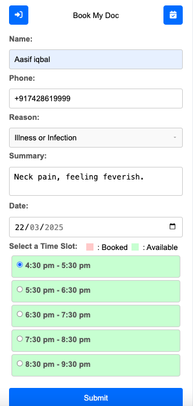

# Real time booking app - BookMyDoc
BookMyDoc is a real-time appointment booking application that connects patients with doctors seamlessly. Built using Node.js, Express, MongoDB, and Socket.io, it enables instant appointment scheduling, live updates, and secure communication. The platform ensures efficient time management for doctors while providing patients with a hassle-free booking experience.

https://www.youtube.com/watch?v=3CpeDrKGW30

## Click below to watch demo

